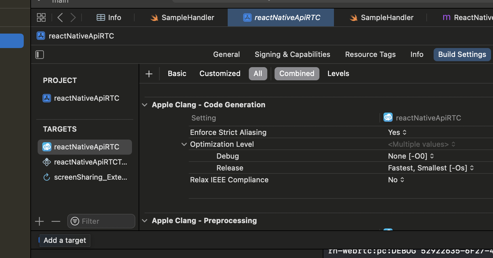
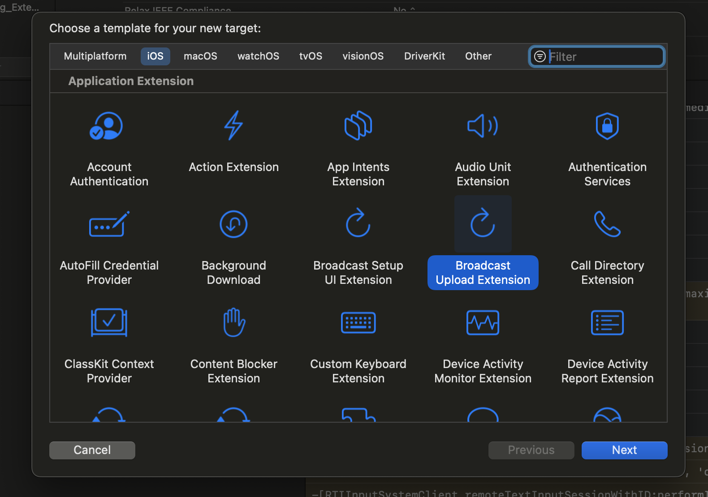
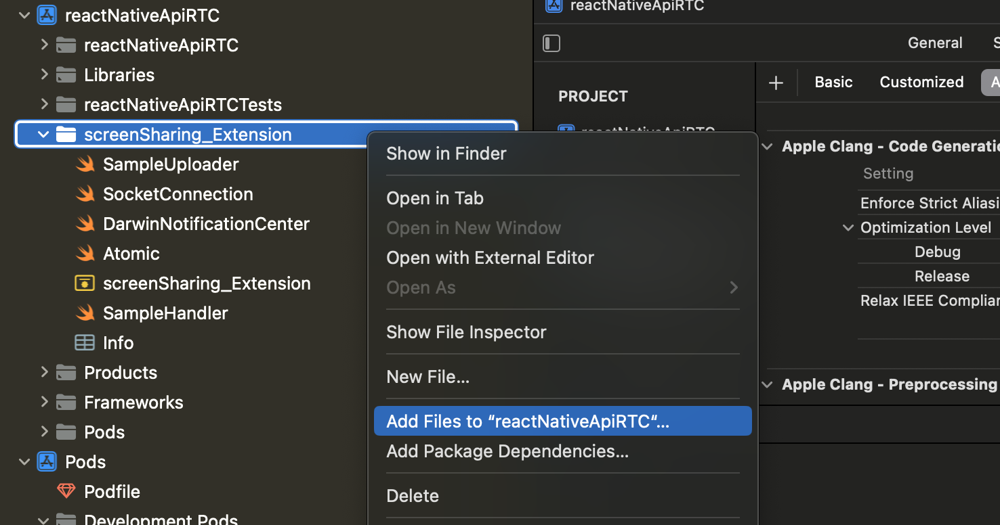
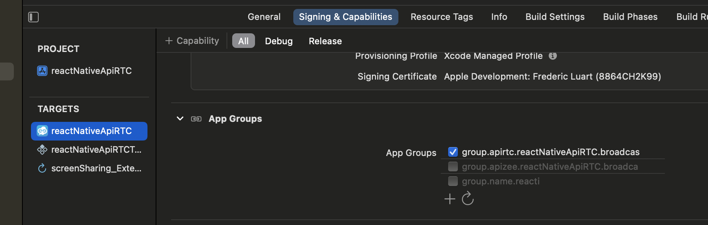

# Add screenSharing on iOS

Please note that screen sharing needs iOS 14+

This feature is also using react-native-webrtc: https://github.com/react-native-webrtc/react-native-webrtc
and is based on this sample: https://jitsi.github.io/handbook/docs/dev-guide/dev-guide-ios-sdk/#screen-sharing-integration

We are using the iOS Broadcast Upload Extension for capturing the contents of the user's screen.
Passing the frames to the React Native WebRTC is done using Unix stream-oriented sockets communication, the extension acting as the client and the React Native WebRTC being the server.

## Create the screenSharing extension

For creating the extension you need to add a new target to your application, selecting the Broadcast Upload Extension template.

Add a target:



Select broadcast extension:



Fill in the desired name ("screenSharing_Extension" in our case), change the language to Swift, make sure Include UI Extension is not selected, as we don't need custom UI for our case, then press Finish (screenshot 1).

You will see that a new folder with the extension's name was added to the project's tree, containing the SampleHandler.swift class. Also, make sure to update the Deployment Info, for the newly created extension, to iOS 14 or newer.

To learn more about creating App Extensions check the [official documentation from Apple](https://developer.apple.com/library/archive/documentation/General/Conceptual/ExtensibilityPG/ExtensionCreation.html).

## Copy and add files to the extension

Copy [SampleUploader.swift](https://github.com/ApiRTC/reactNativeApiRTC/blob/main/ios/screenSharing_Extension/SampleUploader.swift), [SocketConnection.swift](https://github.com/ApiRTC/reactNativeApiRTC/blob/main/ios/screenSharing_Extension/SocketConnection.swift), [DarwinNotificationCenter.swift](https://github.com/ApiRTC/reactNativeApiRTC/blob/main/ios/screenSharing_Extension/DarwinNotificationCenter.swift) and [Atomic.swift](https://github.com/ApiRTC/reactNativeApiRTC/blob/main/ios/screenSharing_Extension/Atomic.swift) files from our raectNativeApiRTC demo project to your extension.

Make sure they are added to the extension's target:



## Add group for the application and extension

Sending the recorded frames to React Native WebRTC is done via Unix SOCK_STREAM sockets. The extension needs to be set up as the client endpoint for this.

SampleHandler.swift initiate the socket connection with React Native WebRTC, using the SocketConnection class.

Even though an app extension bundle is nested within its containing app’s bundle, the running app extension and containing app have no direct access to each other’s containers. We will address this by enabling data sharing. To enable data sharing, use Xcode or the Developer portal to enable app groups for the containing app and its contained app extensions. 

Next, register the app group in the portal and specify the app group to use in the containing app. To learn about working with app groups, see [Adding an App to an App Group](https://developer.apple.com/library/archive/documentation/Miscellaneous/Reference/EntitlementKeyReference/Chapters/EnablingAppSandbox.html#//apple_ref/doc/uid/TP40011195-CH4-SW19).

Add both the app and the extension to the same App Group:



React Native WebRTC needs to know about the app group identifier we have configured the app with. We are doing this by adding a new key named RTCAppGroupIdentifier to the app's Info.plist with the app group identifier as the value.

In our demo, in [Info.plist](https://github.com/ApiRTC/reactNativeApiRTC/blob/main/ios/reactNativeApiRTC/Info.plist), check :
```
	<key>RTCAppGroupIdentifier</key>
	<string>group.apirtc.reactNativeApiRTC.broadcast</string>
```

Also Edit appGroupIdentifier value with your application group value in [SampleHandler.swift](https://github.com/ApiRTC/reactNativeApiRTC/blob/main/ios/screenSharing_Extension/SampleHandler.swift), 
```
    private enum Constants {
        // the App Group ID value that the app and the broadcast extension targets are setup with. It differs for each app.
        static let appGroupIdentifier = "group.apirtc.reactNativeApiRTC.broadcast"
    }
```

Group also enables us to share notifications between the application and the extension:
- broadcaststart : (extension -> application) : used to inform application that the broadcast is started
- broadcaststop : (extension -> application) : used to inform application that the broadcast is finished
- broadcastneedtobestopped : (application -> extension) : used to request the extension to stop the broadcast

## Add extension identifier 

To start screenSharing, we use following code in our app:

```
    apiRTC.Stream.createScreensharingStream(displayMediaStreamConstraints)
        .then(localScreenShare => {
            //Use screen sharing stream
        })
        .catch(err => {
        console.error(err);
        });
```

Internally, createScreensharingStream will use webRTC getDisplayMedia() API from React Native WebRTC library.
React Native WebRTC library needs to know the broadcast extension that need to be started.
We are doing this by adding a new key named RTCScreenSharingExtension to the app's Info.plist and setting the broadcast extension bundle identifier as the value.

In our demo, in [Info.plist](https://github.com/ApiRTC/reactNativeApiRTC/blob/main/ios/reactNativeApiRTC/Info.plist), check :
```
	<key>RTCScreenSharingExtension</key>
	<string>org.reactjs.native.example.reactNativeApiRTC.screenSharing-Extension</string>
```

## Add keys to work in the background  

Also add following keys in [Info.plist](https://github.com/ApiRTC/reactNativeApiRTC/blob/main/ios/reactNativeApiRTC/Info.plist), to make sure that the app will work in the background  :
```
	<key>UIBackgroundModes</key>
	<array>
		<string>audio</string>
		<string>fetch</string>
		<string>processing</string>
		<string>remote-notification</string>
		<string>voip</string>
	</array>
```
